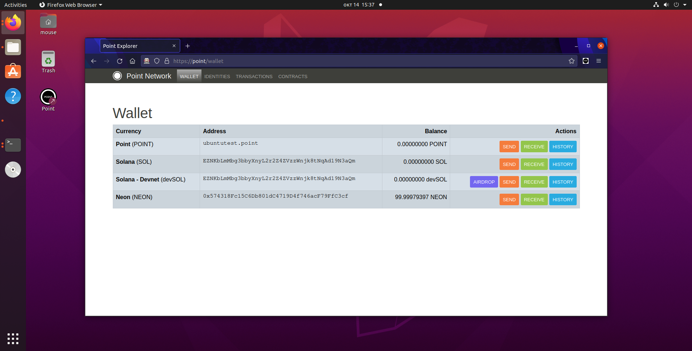

# Point Network Alpha Testing Guide

## Notes

- This is experimental alpha software! If you can and know how, better test it on a virtual machine first (fresh Ubuntu is recommended). If you are not tech-savvy, maybe wait for others to try it out first and see how it goes
- For extra security, we run the alpha node in a Docker container, sandboxing everything, just in case. Docker is used by millions of developers every day, however, please note that Docker might interfere with your firewall and open ports in some cases. We hope you are tech-savvy enough to know what this means and how it applies to your situation and network topology.
- Any troubles? Ask us in our Telegram group: [https://t.me/pointnetworkchat](https://t.me/pointnetworkchat)

## Installation

### Linux

1. Run `wget -qO- pointer.sh | bash` in the terminal, wait until completion
2. PointNetwork Dashboard will run after the script completes
3. In a terminal, run `point-up` to start Point Node
4. Wait until the icons on the dashboard turn green
   * Sometimes it takes time for the browser to download. In that case, if the browser doesn't launch automatically, you can click the browser icon from time to time.
5. PointBrowser will launch and you're ready to go!
6. Continue to "After Installation" section

### Mac OS

1. Run `curl -sL pointer.sh | bash -s` in Terminal, wait until completion, restart the script when Docker is installed
   * When dashboard opens and lights up green: sometimes it takes time for the browser to download. In that case, if the browser doesn't launch automatically, you can click the browser icon from time to time.
2. Continue to "After Installation" section

### Windows 10 and 11

1. Open a PowerShell terminal
2. Download installation script: `Invoke-WebRequest -Uri https://raw.githubusercontent.com/pointnetwork/pointnetwork-dashboard/main/install-windows.ps1 -OutFile ./install-windows.ps1`
3. Set execution policy to RemoteSigned: `Set-ExecutionPolicy RemoteSigned -Scope CurrentUser;`
   * No need to worry about the warning that will be shown, for more details see here: https://stackoverflow.com/questions/64511176/security-risks-of-set-executionpolicy-executionpolicy-remotesigned
5. Run the script: `./install-windows.ps1`
6. The script will ask you to restart your computer.
7. After restarting, if you didn't have WSL before, WSL will be configured
   1. Wait until WSL finishes configuring Ubuntu
   1. Set up your credentials (username and password) in the WSL terminal that is already open
8. If you didn't have Docker before, please accept Docker's Terms of Service
9. Run again the script to open the Point Network Dashboard: `./install-windows.ps1`
   * Sometimes it takes time for the browser to download. In that case, if the browser doesn't launch automatically, you can click the browser icon from time to time.
10. Continue to "After Installation" section

## After Installation

1. Just follow the instructions for Point Dashboard
2. When you register a new secret phrase, and you want to test it again, don't lose it - it will qualify you to be on the list of alpha testers. Next time, you can just *log in* with this phrase instead of registering more one
3. Please report back to the group with screenshots, everyone would love to see each other's progress! https://t.me/pointnetworkchat
